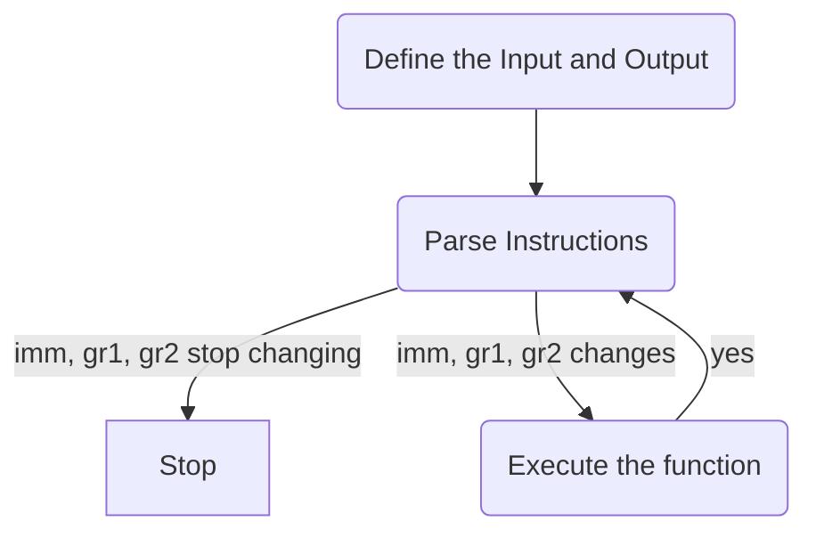

# **Proj3_Report_Zhouliang_Yu_120040077**

## **ALU**
Arithmetic logic unit(ALU) is a combinational digital circuit that performs arithemetic and bitwise operations on integer binary numbers


So in our implementation, the ALU is composed by these components:

```verilog
input signed[31:0] i_datain //input instructions
reg[31:0] reg_A // register A
reg[31:0] reg_B // register B
reg[31:0] reg_C // register C, the result register

//flags
output zero;
output overflow;
output neg;

//alu
module alu //the module alu with implement the algorithm to execute each instructions 
```

## **Work Flow**



## **Parse Instructions**

In our test file we first instantiate the ALU, then we input the instructions by the following manners

```verilog
//addd
#10 i_datain<=32'b000000_00011_00010_00001_00000_100000;
gr1<=32'b0000_0000_0000_0000_1100_0000_0000_0001;
gr2<=32'b0000_0000_0000_0000_0011_0000_0000_1001;
```

Then How do we parse the instruction in the ALU?

We classify the instruction type into R and I types, so for a R-type instruction, the 26 to 31 bits represents opcode, the 6 to 10 bits represent the sa, the 0 to 5 bits indicates the function. Then we assign gr1 to register A, if the sa will be used in the instruction we assign the sa to register B by the following manner:

```verilog
reg_B = {{27{1'b0}}, sa};
```

Otherwise, we simply assign gr2 to reg_B.

If the instruction belongs to I type we extract the last 16 bits as immediate, we than assign the immediate to register B and gr1 to register A. 


## **How to Deal With Overflow**
For instructions: add, addi, sub , bne, beq, we need to deal with the case when overflow happens.  The first we set variable "overflow" as an output, then we declare it to be a register instead of wire. So lets define the cases of overflow. Take 4 bits as example, we list some cases with/without overflow:

```c++
//1+1 = 2
0 0001; //1
0 0001; //1
0 0010; //2 //no overflow
```


```c++
//7 + 7 = 14
0 0111; //1
0 0111; //1
0 1110; //-2 //with overflow
```


```c++
// -1+-1 = -2
1 1111 //-1
1 1111 //-1
1 1110 //-2 //with overflow
```

So for instruction: bne, beq if the MSB of register A, register B =, and register C are all 0, we set the overflow to be 1, otherwise we set it to be 0

For instruction: add, addi, sub we set  the way to assign value to overflow by the following manner

```c++
//for addi 
 overflow = ((reg_A[31] == reg_B[31]) && (~reg_C[31] == reg_A[31]))?1:0;
```
## **Design of ALU**
We mainly introduce some selected functionalities of ALU in this part.

### **Arithmetic Operations**
For arithmetic operation add, sub, addi, subu.., we first set the register A and B according to the method we declared in "Parse Instruction" part. Then we try to assign value to register C, which is the result, based on the particular functionalities.

For add related operations:
```verilog
reg_C = reg_A + reg_B;
```
For sub related operations:
```verilog
reg_C = reg_A - reg_B;
```

### **Branch Operations**
For branch operations bne and beq, we compare the difference between register A and register B, so we assign the register C as:
```verilog
reg_C = reg_A - reg_B;
```
for bne to function reg_C should not be 0, but for beq to branch reg_C should be 0

### **lw and sw**
For sw and lw we simply add the content in register A and register B to register C

### **Shift Bit Operations**
in sra, srav operations we need to shift bits, so we assign the number of shifting in the register B. So we assign register C in the following way.
```verilog 
//sra
reg_C = reg_A >>> reg_B;
```
### **Logical Operation**
In verilog we have the following logical operaters: 
negation (∼), and(&), or(|), xor(^), xnor(^- , -^)
so we can simply design the reg_C according to the operaters.
```verilog
//and 
reg_C = reg_A & reg_B;
//or 
reg_C = reg_A | reg_B;
//xor 
reg_C = reg_A ^ reg_B;
//nor
reg_C = ~(reg_A|reg_B);
```

## **How to Compile**
```verilog
make 
```
the make command will generate the .vvp file, then we can use 
```verilog
vvp test_tb.vvp
```
to show the contents


## **Reference**
1. https://people.cs.pitt.edu/~don/coe1502/spring00/Unit1/ALUTest/ALU_TestBench.html
2. https://stackoverflow.com/questions/35758068/verilog-32-bit-alu-with-overflow-sign-and-zero-flags
